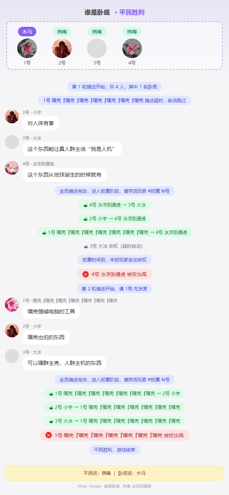

# 谁是卧底 插件

基于 Trss-Yunzai 的谁是卧底游戏插件，支持大模型动态出词、超时自动推进。

# 使用效果


# 安装

在Yunzai根目录下执行：

```bash
git clone --depth=1 https://github.com/Cat-bl/undercover-plugin plugins/undercover-plugin
```

## 指令

| 指令 | 说明 |
|---|---|
| `#谁是卧底` / `#发起卧底` | 群内发起游戏 |
| `#加入卧底` | 加入游戏 |
| `#退出卧底` | 退出游戏（仅等待阶段） |
| `#开始卧底` / `#开始卧底 类型` | 发起人开始游戏，可选指定词组类型（如「二次元」） |
| `#结束卧底` | 强制结束（发起人/主人） |
| `#卧底状态` | 查看当前状态图 |
| `#描述 内容` | 轮到自己时描述词语 |
| `#投票 N号` / `#投票 @某人` | 投票出局 |
| `#弃权` | 投票阶段弃权 |
| `#谁是卧底帮助` | 查看帮助（图片） |

## 流程

1. 发起后，其他玩家发 `#加入卧底`（4~12 人）
2. 发起人发 `#开始卧底`：
   - ① 先向每位玩家发一条**连通性检测**私聊
   - ② 全部能收到后，再调用大模型生成词对（避免白调）
   - ③ 机器人**私聊**发词给每位玩家
3. 按序号顺序，每人发 `#描述 xxx`
4. 全员描述完毕进入投票，每人 `#投票 N号`
5. 得票最多者出局，检查胜负或进入下一轮

玩家需加机器人好友 **或** 群内开启「临时会话」（机器人优先走好友路径，失败自动尝试临时会话）。
若有玩家连通失败，**房间会保留**并列出失败名单，等待该玩家加好友/开启临时会话后发起人再次 `#开始卧底` 即可。除非超时（`waitTimeout`）或 `#结束卧底`，房间不会解散。

## 角色分配

| 玩家数 | 卧底数 | 平民数 |
|---|---|---|
| 4~7 | 1 | 3~6 |
| 8~11 | 2 | 6~9 |
| 12 | 3 | 9 |

按 `floor(n/4)` 自动计算，至少 1 名卧底。

## 胜负

- 卧底全部出局 → 平民胜
- 卧底存活数 ≥ 平民存活数 → 卧底胜

## 词组类型（可选）

`#开始卧底` 支持指定本局词组的主题范围，两种用法：

1. **附加参数**：`#开始卧底 二次元` / `#开始卧底 水果` / `#开始卧底 办公室用品` — 直接传给 AI 作为出题范围
2. **不带参数**：机器人会询问发起人，15 秒内回复类型；回复「跳过」或超时则让 AI 自由出题

仅在 `wordSource: ai` 或 `mix` 时生效（指定类型会强制走 AI，即使 `mix` 也不会降级本地词库）。

另外，每个群的生成历史（最近 30 对）会单独记录，传给 AI 作"避免重复"参考，尽量减少同群内重复出词；群之间互不影响。历史仅保存在内存中，进程重启后清空。

## 投票规则

- **淘汰门槛** (`minVotesToEliminate` 默认 2)：得票最多者需 ≥ 此数才会出局，否则本轮无人出局
- **平票 PK**：若多人得票相同，进入加赛：
  - 平票玩家按序号再描述一次
  - 所有存活玩家再投一次，**只能投平票者**，也可 `#弃权`
  - 单一最高票 → 出局
  - 仍平票 → 本轮无人出局，进入下一轮
- 全员弃权 / 所有投票都未达门槛 → 本轮无人出局，进入下一轮

## 超时机制

所有超时可在 `config.yaml` 调整，到时自动推进：

- **等待阶段** (`waitTimeout` 默认 300 秒)：发起后迟迟未开始 → 自动结束
- **描述阶段** (`describeTimeout` 默认 120 秒)：轮到的玩家不发言 → 自动跳过，换下一人
- **投票阶段** (`voteTimeout` 默认 120 秒)：整个投票阶段共享一个 timer，时间到未投的全部自动弃权并结算
- **预警提醒** (`warnBefore` 默认 30 秒)：描述/投票阶段超时前自动 @ 提醒目标玩家，设为 `0` 关闭

## 配置

首次启动会自动生成 `config/config.yaml`，修改后**自动热更新**，无需重启。

```yaml
# 词库来源：ai（纯 AI）| local（纯本地）| mix（AI 优先，失败降级本地）
wordSource: mix

ai:
  apiUrl: https://openai/v1/chat/completions  # OpenAI 兼容接口
  apiKey: ""                                  # 必填
  model: gemini-2.5-flash                     # 模型名
  timeout: 120                                # 请求超时（秒）
  retryCount: 3                               # 失败重试次数
  temperature: 1.1                            # 随机度，越高越多样
  systemPrompt: ...                           # 出题系统提示词
  userPrompt: ...                             # 用户提示词

game:
  minPlayers: 4                               # 最少玩家数
  maxPlayers: 12                              # 最多玩家数
  maxMessages: 40                             # 渲染图最多保留的聊天消息数
  describeTimeout: 120                        # 描述每人发言超时（秒）
  voteTimeout: 120                            # 投票阶段总超时（秒）
  waitTimeout: 300                            # 等待阶段总超时（秒）
  warnBefore: 30                              # 超时前多少秒 @ 提醒，0 关闭
  minVotesToEliminate: 2                      # 淘汰所需最少得票数
```

## 词库

本地兜底词库在 `resources/words.json`，约 90 对常见词，可自由增删。仅在 `wordSource: local` 或 `mix` 降级时使用。
